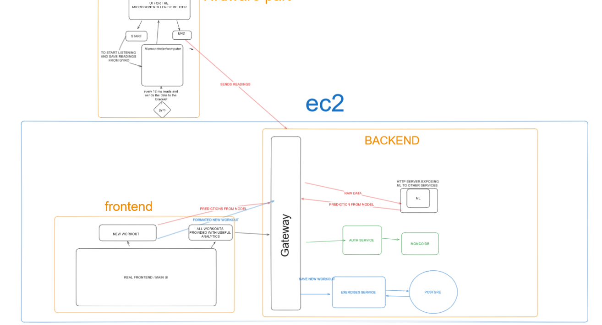
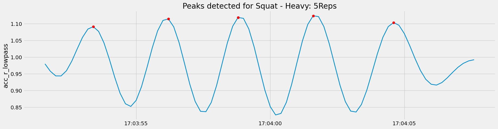
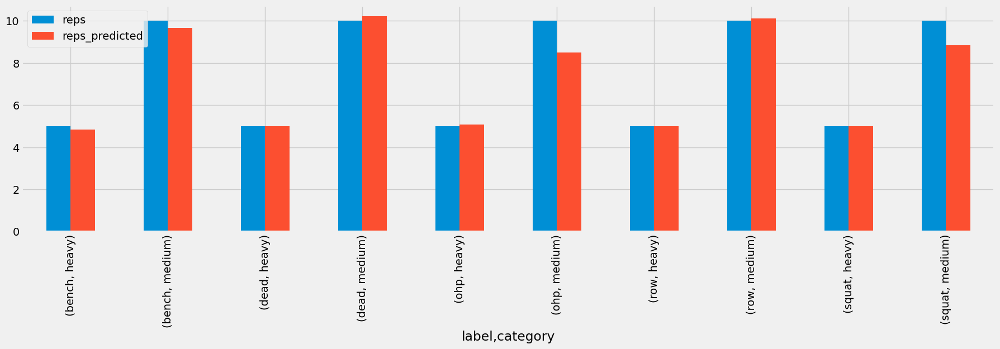

# Track Fit

Track Fit is a comprehensive fitness solution that uses easy to use technology to monitor and analyze your workouts. With Track Fit, users can track their workout sessions using a fitness bracelet equipped with advanced sensors, with minimal effort of their side for entering information. Here's how it works:

We chose to work on this topic, because we are all share a common hobby- gym workouts and some of us don't have a gym buddy, so we struggle with keeping track of our workout while watching if we do the exercises correctly.

## Getting Started

1. **Start Tracking**: When initiating a workout session, users activate the tracking feature on their fitness bracelet.

2. **Perform Exercises**: As users perform exercises within their workout routine, the fitness bracelet continuously monitors and records movement data.

3. **Finish Tracking**: Once the workout is complete, users signal the end of tracking on their fitness bracelet. At this point, they have the option to review each exercise performed during the workout session.

4. **Exercise Information**: Since the types of exercises performed and repetitions will be found by the ml, users less info for each exercise - just the amount of weight used.

5. **Backend Processing**: Upon finishing the workout session, the recorded exercise data, including movement patterns, exercise names, weights, and repetitions, is sent to the backend server for processing.

6. **Web Application**: Users can access a web application to view detailed analyses of their workout sessions. The application provides insights into various aspects of the workout, including movement patterns, exercise performance metrics, and overall workout effectiveness.

7. **Personalized Insights**: The web application offers personalized insights tailored to each user's workout history. For example, users can compare movement patterns across different workout sessions, assess how exercise performance varies with different weights, and receive recommendations for optimizing their training regimen.

## ARCHITECTURE

## FITNESS EXERCISE PREPROCESSED ANALYSIS - SQUAT

## PREDICTED REPS vs REAL REPS -> 96.4% accuracy

## Usage

To use Track Fit, follow these steps:

1. Initiate a workout session on your fitness bracelet.
2. Perform exercises as usual while the bracelet tracks your movement patterns.
3. End the workout session on your bracelet and provide additional information about each exercise performed.
4. Access the Track Fit web application to view detailed analyses and personalized insights of your workout sessions.

## Technologies Used

- SKlearn (ML)
- FastAPI,NodeJS _with TS_ (backend)
- raspberry pi 4 (embedded)
- NextJS (frontend)
